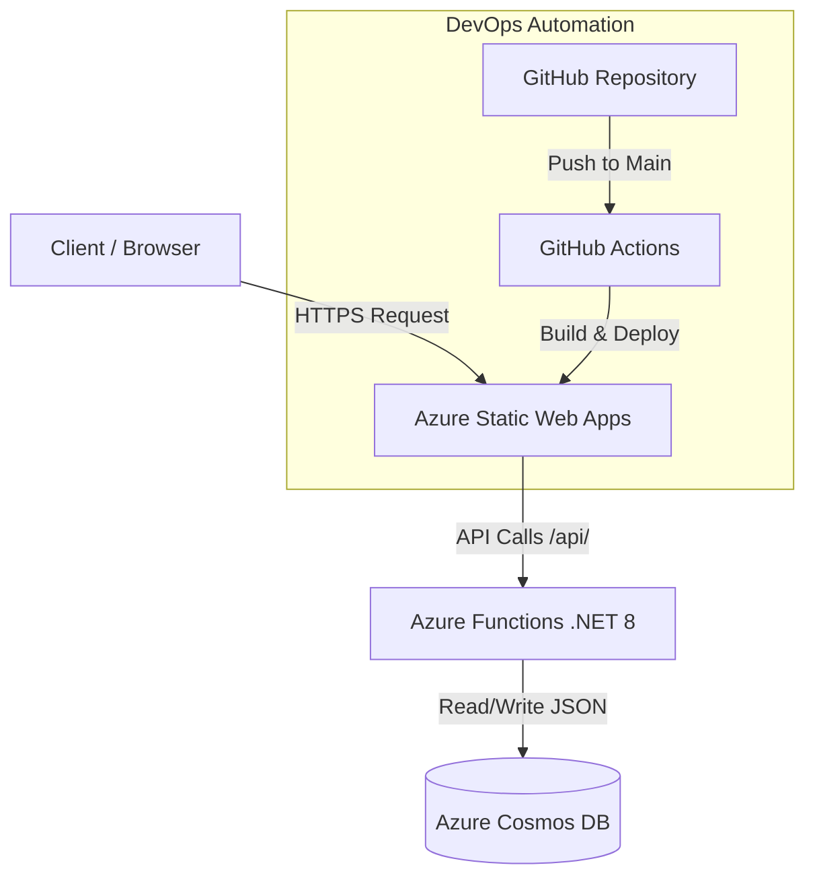

# ☁️ Cloud-Native Serverless Resume

## 🚀 Project Overview

This project demonstrates a full-stack, cloud-native application deployed on **Microsoft Azure**. The goal was to engineer a serverless solution that decouples the frontend from the backend to maximize scalability, ensure high availability, and optimize costs.

The application serves as my professional Cloud Resume. It features a bilingual (English/Spanish) static frontend and a robust **.NET 8.0 serverless API** that tracks and updates visitor counts in real-time, fully automated via a CI/CD pipeline.

### 🔗 Live Demo
[View Live Resume](https://brave-water-089a7670f.1.azurestaticapps.net/)

---

## 🏗️ Architecture

The solution leverages Azure's serverless ecosystem to handle varying loads without manual infrastructure management.

### 🧩 Components
1. **Frontend (Azure Static Web Apps):** 
   - A modern, responsive, and bilingual CV built with HTML5, CSS3, and Vanilla JavaScript.
   - Includes a custom-built Splash Screen for language selection (ES/EN).
   - Designed with print CSS media queries to generate a perfect 1-page ATS-friendly PDF dynamically via the browser's native print engine.
2. **Backend (Azure Functions):** 
   - A serverless HTTP trigger function written in **C# (.NET 8)**.
   - Handles the logic for retrieving and incrementing the visitor counter.
3. **Database (Azure Cosmos DB):** 
   - NoSQL database used to persist the visitor count efficiently with minimal latency.
4. **CI/CD (GitHub Actions):** 
   - Automated deployment pipelines trigger on every push to the main branch, ensuring continuous integration and delivery.

---

## 💻 Technical Details & Implementation

### Frontend Features
- **Bilingual Interface:** Splash screen routes users to `resume-es.html` or `resume-en.html`.
- **Dynamic PDF Generation:** Replaced static PDF downloads with `window.print()`, leveraging custom `@media print` CSS rules (scaling down to `10.5px` and `30%/70%` grid columns) to guarantee a flawless 1-page A4 PDF output that is 100% readable by Applicant Tracking Systems (ATS).
- **API Integration:** JavaScript uses the `fetch` API to asynchronously call the Azure Function and update the visitor badge seamlessly.

### Backend Features
- **Serverless Compute:** The Azure Function executes only when triggered, minimizing costs (Pay-as-you-go).
- **Cosmos DB Bindings:** Uses input and output bindings in C# to interact with Cosmos DB without writing boilerplate connection code, improving execution speed and maintainability.

---

## 👨‍💻 About the Author

**Marcos Sena**  
*Cloud Administrator | Azure Specialist*  
📍 Caracas, Venezuela  
🔗 [LinkedIn](https://www.linkedin.com/in/marcos-sena-954158252) | 🐙 [GitHub](https://github.com/Manicrai)

Certified Azure Administrator (AZ-104) and Azure Virtual Desktop Specialty (AZ-140) focused on hybrid infrastructure, OS optimization, and Cloud Native development.
